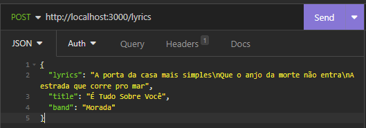

### Description

### Installation

1. Clone the project

1. Install the dependencies: 
    ```bash
    npm install
    ```

1. Run the server: 
    ```bash
    npm start
    ```

### Usage

1. Run the server using: 
    ```bash 
    npm start
    ```

1. Find the lyrics of the songs on ["letras.mus.com"](https://letras.mus.br/) or similars;

1. On ChatGPT, use the following prompt: 
    > Adicione \n no lugar de cada line break e \n\n entre cada parágrafo

1. Copy the result and enter Insomnia, Postman or similars;

1. The request should be as the following

    

1. That's it, the .pptx is created

### Contributors

[Gustavo Bezerra da Paixão](https://github.com/gbpaixao)